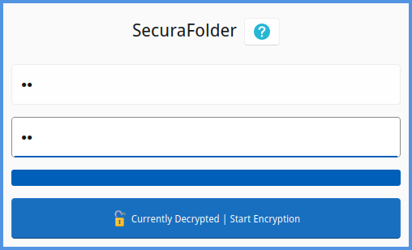
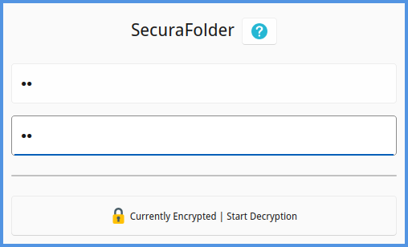

# SecuraFolder

## Overview
SecuraFolder is a portable encryption tool that enables you to securely store your files on any computer without the need for installation. It’s ideal for use with USB flash drives and other portable storage devices, providing the ability to protect and access your sensitive files wherever you go.

 

## Getting Started

### System Requirements
- Compatible with **Windows**, **macOS**, and **Linux**
- **No installation required**
- Minimal system resources needed

### Initial Setup
1. Copy the three executable files to your desired storage media (e.g., USB drive, external hard drive, etc.).
2. Use the correct executable for your operating system.
3. Upon launching the application for the first time, it will automatically create a "Secura" folder on your storage device.

## Basic Operations

### Using SecuraFolder
1. Open the application using the correct executable for your operating system.
2. Place the files you wish to encrypt inside the "Secura" folder.
3. Click the **Encrypt** button to secure the files before closing the application.
4. To access or add files later, open the application and use the **Decrypt** button.

## Best Practices
- Always re-encrypt your folder after accessing files.
- Never interrupt the encryption or decryption process.
- Regularly back up your encrypted files to avoid data loss.
- Use a **strong, unique password** to secure your files.
- Close all files in the "Secura" folder before encrypting.

## Troubleshooting

### Cannot Open SecuraFolder
- Verify you're using the correct executable for your operating system.
- Try running the application as **administrator**.
- Check if antivirus software is blocking the application.

### Encryption Fails
- Ensure all files in the "Secura" folder are closed.
- Verify there is sufficient **disk space** available.
- Check that none of the files are set to **read-only**.

### Decryption Fails
- Double-check that you're entering the **correct password**.
- Ensure the encrypted files haven’t been **moved or modified**.
- Verify there is sufficient disk space for the decryption process.

### Password Recovery
- **There is no password recovery option.**
- Keep your password in a secure location.
- If the password is lost, files cannot be recovered.

## Safety Warnings
- **Never** delete or modify encrypted files directly; always use the application interface.
- Keep backup copies of important files in a secure location.
- Do not share your password with others.
- Always close the application when not in use to protect your data.
